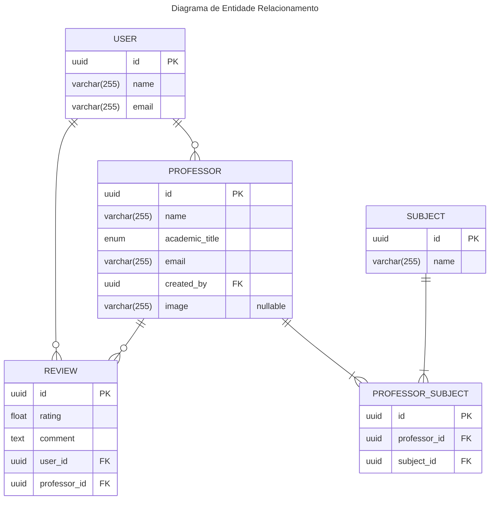

```mermaid

---
title: Diagrama de Entidade Relacionamento
---
erDiagram

PROFESSOR {
    uuid id PK
    varchar(255) name
    enum academic_title
    varchar(255) email
    uuid created_by FK
    varchar(255) image "nullable"
}

USER {
    uuid id PK
    varchar(255) name
    varchar(255) email
}

REVIEW {
    uuid id PK
    float rating
    text comment
    uuid user_id FK
    uuid professor_id FK
}

SUBJECT {
    uuid id PK
    varchar(255) name
}

PROFESSOR_SUBJECT {
    uuid id PK
    uuid professor_id FK
    uuid subject_id FK
}

USER 1 to 0+ PROFESSOR : ""
USER 1 to 0+ REVIEW : ""
PROFESSOR 1 to 0+ REVIEW : ""
PROFESSOR 1 to 1+ PROFESSOR_SUBJECT : ""
SUBJECT 1 to 1+ PROFESSOR_SUBJECT : ""

```
